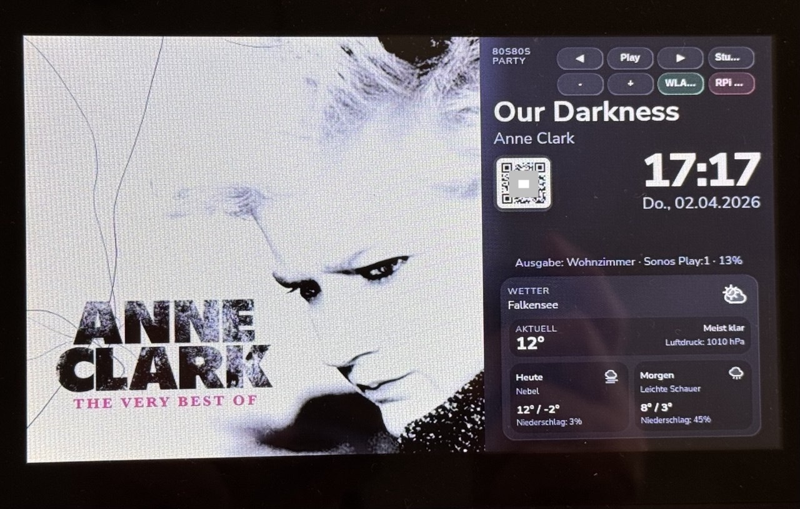

# OnRadio Cover Bridge


Ein Raspberry-Pi-basiertes **Radio- und Infodisplay** mit **Mobile-Webcontroller**, **Albumcover**, **Uhrzeit**, **Wetter**, **QR-Code** und **Audio-Ausgabe auf WLAN-/UPnP-Lautsprecher**.

**Short English summary:**

**OnRadio Cover Bridge** is a Raspberry Pi–based internet radio and information display for home networks. It runs as a kiosk-style display on a Raspberry Pi with a 7-inch screen and can be controlled from a smartphone. The system shows album covers, track information, time, date, weather, QR access code, and playback status, while streaming audio to WLAN/UPnP speakers such as Sonos or Denon. It is built with FastAPI, Chromium kiosk mode, systemd services, and Python.

[1]: https://github.com/TBR-BRD/onradio-cover-bridge "GitHub - TBR-BRD/onradio-cover-bridge: onradio-cover-bridge · GitHub"


<br>
<a href="https://www.buymeacoffee.com/thoralf.brandt" target="_blank">
  
</a>
<br>

Das System ist für einen Raspberry Pi 3 mit offiziellem 7-Zoll-Display als dauerhaft laufendes Kiosk-Display im Heimnetz gedacht.  
Die Steuerung erfolgt komfortabel über ein iPhone oder ein anderes Smartphone im gleichen WLAN.



Foto der RPi Oberfläche

## Highlights

- Internetradio-Steuerung per Smartphone im Heimnetz
- Albumcover, Titelinfos, Uhrzeit und Wetter auf dem Raspberry-Pi-Display
- Ausgabe auf WLAN-/UPnP-Lautsprecher wie Sonos oder Denon
- Touch-Bedienung direkt am Raspberry Pi
- QR-Code für schnellen Zugriff auf den Webcontroller
- Automatischer Kiosk-Start nach dem Boot
- Optimiert für kleine Raspberry-Pi-Touchdisplays

## Features

### Radio / Sender
- Auswahl vieler Internetradio-Sender über den Mobile-Webcontroller
- Senderliste als direkt anklickbare Liste, kein Drop-down
- Start / Stop der Wiedergabe
- Senderwechsel per Mobile-Controller
- Senderwechsel zusätzlich direkt auf dem Raspberry-Pi-Display
- Wiedergabe über WLAN-/UPnP-Lautsprecher

### Anzeige
- Großes Cover links
- Titel und Interpret rechts
- Große Uhrzeit und Datum
- QR-Code zum Controller
- Ausgabeanzeige für den aktiven Lautsprecher
- Wetteranzeige für Falkensee

### Wetter
- aktueller Zustand
- aktuelle Temperatur
- Luftdruck
- Luftdruck-Trendpfeil
- Vorhersage für heute und morgen
- Wettersymbole

### System
- FastAPI-Webserver
- Chromium-Kiosk auf dem Pi
- systemd-Service
- Display-Zeitfenster
- Shutdown-Button auf dem Pi
- Hintergrundfehler werden unauffällig behandelt

## Architektur

```text
Smartphone / iPhone
        |
        | HTTP / WLAN
        v
+----------------------+
|   Raspberry Pi 3     |
|----------------------|
| FastAPI Webserver    |
| Kiosk-Display        |
| Cover-Logik          |
| Wetterdienst         |
| UPnP Stream Relay    |
+----------------------+
        |            \
        |             \
        v              v
  7" Raspberry        WLAN-/UPnP-
  Pi Display          Lautsprecher
```

## Voraussetzungen

- Raspberry Pi 3
- Raspberry Pi OS mit Desktop
- offizielles Raspberry Pi Display
- WLAN im lokalen Netzwerk
- Smartphone / iPhone für den Controller
- WLAN-/UPnP-Lautsprecher
- Python 3
- Chromium im Kiosk-Modus

## Schnellstart

### 1. System vorbereiten

```bash
sudo apt update
sudo apt full-upgrade -y
sudo apt install -y python3-full python3-pip python3-venv unzip wtype swayidle unclutter
sudo raspi-config nonint do_ssh 0
sudo raspi-config nonint do_boot_behaviour B4
sudo raspi-config nonint do_boot_wait 1
sudo raspi-config nonint do_blanking 1
```

### 2. Projekt auf den Pi kopieren

```bash
scp onradio-cover-bridge.zip pi@<PI-IP>:~
ssh pi@<PI-IP>
```

### 3. Projekt installieren

```bash
unzip -o ~/onradio-cover-bridge.zip -d ~
sudo rm -rf /opt/onradio-cover-bridge
sudo mv ~/onradio-cover-bridge /opt/onradio-cover-bridge
sudo chown -R pi:pi /opt/onradio-cover-bridge

cd /opt/onradio-cover-bridge
python3 -m venv .venv
source .venv/bin/activate
pip install --upgrade pip
pip install -r requirements.txt
```

### 4. Teststart

```bash
cd /opt/onradio-cover-bridge
source .venv/bin/activate
uvicorn app.main:app --host 0.0.0.0 --port 8080
```

Danach testen:
- Controller: `http://<PI-IP>:8080/controller`
- Display: `http://127.0.0.1:8080/display`

### 5. systemd-Service einrichten

```bash
sudo cp /opt/onradio-cover-bridge/scripts/onradio-cover.service /etc/systemd/system/onradio-cover.service
sudo systemctl daemon-reload
sudo systemctl enable --now onradio-cover.service
```

### 6. Shutdown-Button aktivieren

```bash
sudo cp /opt/onradio-cover-bridge/scripts/onradio-cover-poweroff.sudoers /etc/sudoers.d/onradio-cover-poweroff
sudo chmod 440 /etc/sudoers.d/onradio-cover-poweroff
sudo visudo -cf /etc/sudoers.d/onradio-cover-poweroff
```

### 7. Kiosk-Start einrichten

```bash
cp /opt/onradio-cover-bridge/scripts/start-radio-display.sh /home/pi/start-radio-display.sh
chmod +x /home/pi/start-radio-display.sh

mkdir -p /home/pi/.config/labwc
printf '/home/pi/start-radio-display.sh\n' > /home/pi/.config/labwc/autostart
```

### 8. Mauszeiger ausblenden / Kiosk stabilisieren

```bash
bash /opt/onradio-cover-bridge/scripts/install-labwc-hide-cursor.sh
```

### 9. Neustart

```bash
sudo reboot
```

## Aufruf

- Mobile-Controller: `http://<PI-IP>:8080/controller`
- Raspberry-Pi-Display: `http://127.0.0.1:8080/display`

## Hinweise

- Die Audio-Ausgabe am Raspberry Pi selbst wurde entfernt.
- Die Wiedergabe erfolgt über WLAN-/UPnP-Lautsprecher.
- Nicht belastbar verifizierte Streams können aus der Senderliste entfernt werden.
- Siehe `INSTALLATION_DE.md` für die vollständige Installationsanleitung.
