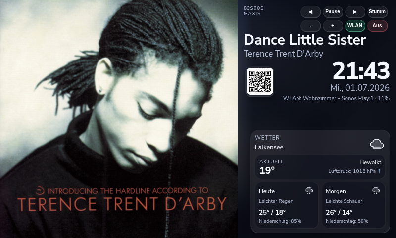
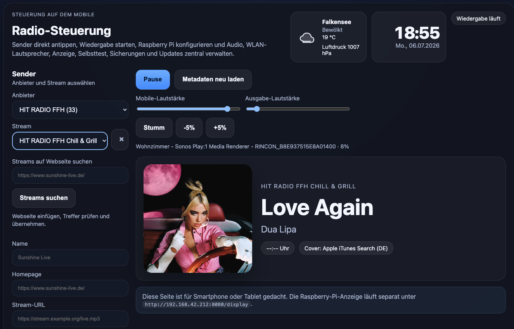
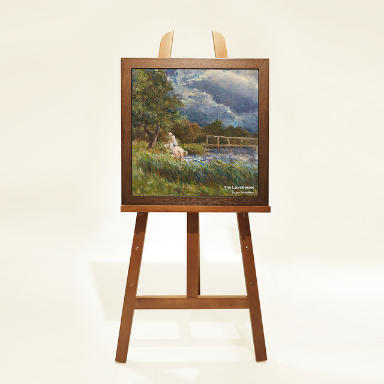
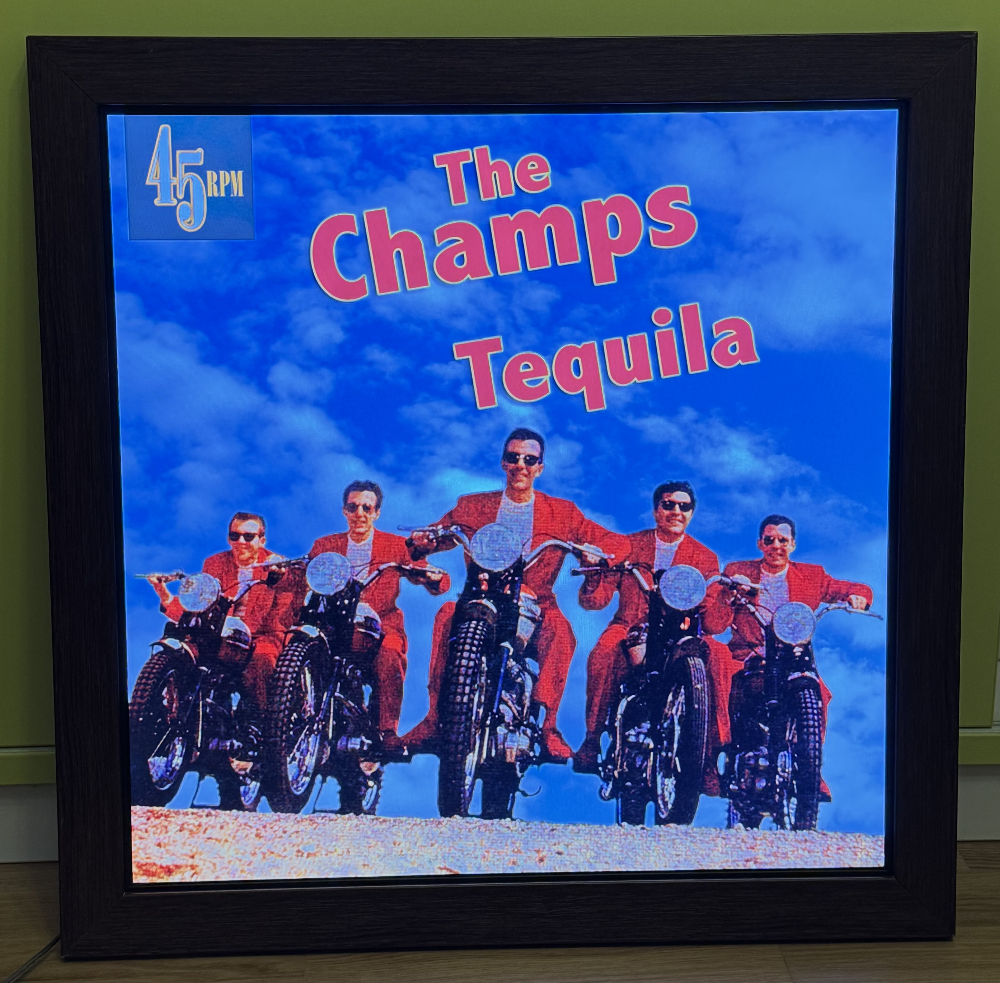

# OnRadio Cover Bridge


Ein Raspberry-Pi-basiertes Radio- und Infodisplay mit **Mobile-Webcontroller**, **Albumcover**, **Titelinformationen**, **Uhrzeit**, **Wetter**, **QR-Code**, **Systemmonitoring** und **Audio-Ausgabe auf WLAN-/UPnP-Lautsprecher**.

Das System verwendet einen Raspberry Pi 3 als zentrale Instanz. Neben dem lokalen Raspberry-Pi-Display kann ein separates **BBuzzCanvas** als zusätzliches Fullscreen-Coverdisplay genutzt werden.

## Highlights

- Internetradio-Steuerung per Smartphone im lokalen Netzwerk
- Albumcover, Titel, Interpret, Uhrzeit, Datum und Wetter auf dem Raspberry-Pi-Display
- separates Fullscreen-Coverdisplay auf einem BBuzzCanvas
- Ausgabe auf WLAN-/UPnP-Lautsprecher wie Sonos oder Denon
- Touch-Bedienung direkt auf dem Raspberry Pi
- QR-Code für schnellen Zugriff auf den Webcontroller
- CPU-, RAM-, Temperatur-, Load-, Throttling- und Uptime-Anzeige im Controller
- automatischer Start des Webdienstes und des Raspberry-Pi-Kiosk-Browsers
- Display-Zeitfenster für den Raspberry Pi

## Raspberry Pi Display Oberfläche



## Controller Browser- Oberfläche



## BBuzzCanvas Cover Display



Als zweites Display kann ein BBuzzCanvas verwendet werden. Es zeigt ausschließlich das aktuelle Albumcover im Fullscreen-Modus.

## BBuzzCanvas Cover Display im Betrieb



Cover-Endpunkt:

```text
http://<PI-IP>:8080/cover
```

Für das aktuell verwendete BBuzzCanvas ist aufgrund der Displayausrichtung folgende Variante geeignet:

```text
http://<PI-IP>:8080/cover?rotate=left
```

Die passende Android-5.1-Kiosk-App befindet sich in einem separaten Repository:

https://github.com/TBR-BRD/bbuzzcanvas-cover-kiosk

## Funktionen

### Radio / Sender

- Auswahl vieler Internetradio-Sender über den Mobile-Webcontroller
- Senderliste als direkt anklickbare Liste ohne Drop-down
- Start / Stop der Wiedergabe
- Senderwechsel per Mobile-Controller
- Senderwechsel zusätzlich direkt auf dem Raspberry-Pi-Display
- Wiedergabe über WLAN-/UPnP-Lautsprecher
- Stream-Relay über den Raspberry Pi für bessere Renderer-Kompatibilität

### Titelinformationen und Metadaten

- Anzeige von Sendername, Titel und Interpret
- automatische Aktualisierung der Metadaten
- mehrere Metadatenquellen je nach Sender
- Fallback auf ICY-Metadaten oder senderabhängige Playlist-/Webquellen
- spezielle Behandlung einzelner Sender, wenn deren Metadatenformat abweicht

### Cover-Anzeige

- Anzeige des aktuellen Albumcovers
- bevorzugte Nutzung geeigneter Coverquellen
- lokale Auslieferung externer Cover über einen Cover-Proxy
- Fallback-Logik bei nicht erreichbaren Cover-URLs
- eigenes Platzhalterbild bei fehlendem Albumcover
- separate `/cover`-Seite für reine Fullscreen-Anzeige
- Rotation der Fullscreen-Coverseite per URL-Parameter

### Raspberry-Pi-Display

- Kiosk-Oberfläche unter `/display`
- großes Cover links
- Titel und Interpret rechts
- große Uhrzeit und Datum
- QR-Code zum Controller
- kompakte Ausgabeanzeige für den aktiven Lautsprecher
- Wetteranzeige für Falkensee
- Touch-Bedienung direkt am Display
- Shutdown-Button für den Raspberry Pi
- automatischer Kiosk-Start nach dem Boot
- Mauszeiger im Kiosk-Betrieb ausgeblendet
- Display-Zeitfenster standardmäßig von 08:00 bis 22:00 Uhr

### Wetter

- aktueller Wetterzustand für Falkensee
- aktuelle Temperatur
- Luftdruck
- Luftdruck-Trendpfeil
- Vorhersage für heute und morgen
- lokale Wettersymbole
- serverseitiges Caching der Wetterdaten

### Mobile-Webcontroller

Der Controller ist unter folgender URL erreichbar:

```text
http://<PI-IP>:8080/controller
```

Funktionen:

- Senderauswahl
- Wiedergabesteuerung
- Lautstärkesteuerung
- Auswahl des WLAN-/UPnP-Ausgabegeräts
- Suche nach verfügbaren UPnP-/DLNA-Renderern
- Uhrzeit, Datum und Wetter
- Konfiguration des Display-Zeitfensters
- Backup- und Wartungsfunktionen
- Systemmonitoring des Raspberry Pi

### Systemmonitor im Controller

Der Systemmonitor wird ausschließlich im Webcontroller angezeigt und belastet die eigentlichen Displays nicht mit zusätzlichen Informationen.

Angezeigt werden:

- CPU-Auslastung
- CPU-Maximum der letzten fünf Minuten
- RAM-Auslastung
- CPU-Temperatur
- Load Average
- Throttling / Unterspannung
- System-Uptime

API:

```text
http://<PI-IP>:8080/api/system
```

### WLAN-/UPnP-Lautsprecher

- automatische Erkennung von UPnP-/DLNA-Media-Renderern im lokalen Netzwerk
- Auswahl eines aktiven Ausgabegeräts
- Unterstützung für Sonos- und Denon-ähnliche Renderer
- lokaler Stream-Relay über den Raspberry Pi
- Anzeige des aktiven Lautsprechernamens auf dem Display
- Audio-Ausgabe am Raspberry Pi selbst ist nicht erforderlich

### BBuzzCanvas Android-Kiosk

Das BBuzzCanvas verwendet eine kleine Android-5.1-kompatible WebView-Kiosk-App.

Funktionen der Android-App:

- Fullscreen-/Immersive-Modus
- Status- und Navigationsleiste ausgeblendet
- Bildschirm bleibt eingeschaltet
- Cover-URL beim ersten Start konfigurierbar
- URL später per Langdruck änderbar
- automatische Wiederverbindung bei Ladefehlern
- Autostart nach Android-Boot
- keine private IP-Adresse fest im Quellcode

Projekt:

https://github.com/TBR-BRD/bbuzzcanvas-cover-kiosk

## Architektur

```text
                         Smartphone / Browser
                                |
                                | HTTP / WLAN
                                v
                  +-----------------------------+
                  |       Raspberry Pi 3        |
                  |    OnRadio Cover Bridge     |
                  |-----------------------------|
                  | FastAPI Webserver           |
                  | Radio-/Senderlogik          |
                  | Stream-Auflösung            |
                  | Metadaten / Titel           |
                  | Cover-Auflösung / Proxy     |
                  | Wetterdienst                |
                  | Controller API              |
                  | Systemmonitoring            |
                  | UPnP / Audio Control        |
                  +-------------+---------------+
                                |
            +-------------------+--------------------+
            |                   |                    |
            v                   v                    v
     Raspberry Pi          BBuzzCanvas           WLAN / UPnP
     7" Display            Android 5.1           Lautsprecher
     /display              Kiosk-App             Sonos / Denon
                            /cover
                            /cover?rotate=left
```

### Datenfluss

1. Der Mobile-Webcontroller sendet Steuerbefehle an den Raspberry Pi.
2. Der Raspberry Pi verwaltet Sender, Stream-URLs und Wiedergabestatus.
3. Titel und Interpret werden aus den verfügbaren Metadatenquellen ermittelt.
4. Das passende Albumcover wird aufgelöst und bei Bedarf über den lokalen Cover-Proxy bereitgestellt.
5. Das Raspberry-Pi-Display ruft `/display` auf und zeigt die vollständige Informationsoberfläche.
6. Das BBuzzCanvas ruft `/cover` auf und zeigt ausschließlich das aktuelle Cover.
7. Der ausgewählte WLAN-/UPnP-Lautsprecher erhält den Radio-Stream über den Raspberry Pi.
8. Der Controller ruft zusätzlich `/api/system` für die Systemzustandsanzeige ab.

## Wichtige URLs

| Funktion | URL |
| --- | --- |
| Mobile-Webcontroller | `http://<PI-IP>:8080/controller` |
| Raspberry-Pi-Display | `http://<PI-IP>:8080/display` |
| BBuzzCanvas Cover | `http://<PI-IP>:8080/cover` |
| BBuzzCanvas gedreht | `http://<PI-IP>:8080/cover?rotate=left` |
| Status-API | `http://<PI-IP>:8080/api/state` |
| Systemmonitor | `http://<PI-IP>:8080/api/system` |
| UPnP-Status | `http://<PI-IP>:8080/api/upnp/state` |

## Voraussetzungen

- Raspberry Pi 3
- Raspberry Pi OS mit Desktop
- offizielles Raspberry Pi 7-Zoll-Display
- WLAN oder LAN im lokalen Netzwerk
- Smartphone / iPhone für den Controller
- UPnP-/DLNA-kompatibler WLAN-Lautsprecher
- Python 3
- Chromium im Kiosk-Modus
- optional: BBuzzCanvas mit Android 5.1 und BBuzzCanvas Cover Kiosk App

## Schnellstart

### 1. Raspberry Pi vorbereiten

```bash
sudo apt update
sudo apt full-upgrade -y
sudo apt install -y python3-full python3-pip python3-venv unzip wtype swayidle unclutter
sudo raspi-config nonint do_ssh 0
sudo raspi-config nonint do_boot_behaviour B4
sudo raspi-config nonint do_boot_wait 1
sudo raspi-config nonint do_blanking 1
```

### 2. Projekt auf den Raspberry Pi kopieren

```bash
scp onradio-cover-bridge.zip pi@<PI-IP>:~
ssh pi@<PI-IP>
```

### 3. Projekt installieren

```bash
unzip -o ~/onradio-cover-bridge.zip -d ~
sudo rm -rf /opt/onradio-cover-bridge
sudo mv ~/onradio-cover-bridge /opt/onradio-cover-bridge
sudo chown -R pi:pi /opt/onradio-cover-bridge

cd /opt/onradio-cover-bridge
python3 -m venv .venv
source .venv/bin/activate
pip install --upgrade pip
pip install -r requirements.txt
```

### 4. Teststart

```bash
cd /opt/onradio-cover-bridge
source .venv/bin/activate
uvicorn app.main:app --host 0.0.0.0 --port 8080
```

Danach testen:

- Controller: `http://<PI-IP>:8080/controller`
- Display: `http://<PI-IP>:8080/display`
- Coverdisplay: `http://<PI-IP>:8080/cover`

### 5. systemd-Service einrichten

```bash
sudo cp /opt/onradio-cover-bridge/scripts/onradio-cover.service /etc/systemd/system/onradio-cover.service
sudo systemctl daemon-reload
sudo systemctl enable --now onradio-cover.service
```

### 6. Shutdown-Button aktivieren

```bash
sudo cp /opt/onradio-cover-bridge/scripts/onradio-cover-poweroff.sudoers /etc/sudoers.d/onradio-cover-poweroff
sudo chmod 440 /etc/sudoers.d/onradio-cover-poweroff
sudo visudo -cf /etc/sudoers.d/onradio-cover-poweroff
```

### 7. Kiosk-Start einrichten

```bash
cp /opt/onradio-cover-bridge/scripts/start-radio-display.sh /home/pi/start-radio-display.sh
chmod +x /home/pi/start-radio-display.sh

mkdir -p /home/pi/.config/labwc
printf '/home/pi/start-radio-display.sh\n' > /home/pi/.config/labwc/autostart
```

### 8. Mauszeiger ausblenden

```bash
bash /opt/onradio-cover-bridge/scripts/install-labwc-hide-cursor.sh
```

### 9. Neustart

```bash
sudo reboot
```

Für die vollständige Installation siehe:

- [`INSTALLATION_DE.md`](INSTALLATION_DE.md)
- [`INSTALLATION_EN.md`](INSTALLATION_EN.md)

## Diagnose

Dienststatus:

```bash
sudo systemctl status onradio-cover.service
```

Letzte Logs:

```bash
sudo journalctl -u onradio-cover.service -n 120 --no-pager
```

System-API:

```bash
curl http://127.0.0.1:8080/api/system
```

UPnP-Status:

```bash
curl http://127.0.0.1:8080/api/upnp/state
```

## Projektstruktur

```text
onradio-cover-bridge/
├── app/
│   ├── static/
│   ├── templates/
│   ├── main.py
│   ├── stations.py
│   ├── playlist_fetcher.py
│   ├── cover_provider.py
│   ├── weather_service.py
│   ├── upnp_renderer.py
│   ├── selftest_service.py
│   └── config_manager.py
├── scripts/
│   ├── start-radio-display.sh
│   ├── onradio-cover.service
│   ├── onradio-cover-poweroff.sudoers
│   └── install-labwc-hide-cursor.sh
├── docs/
│   └── media/
│       └── bbuzzcanvas.png
├── INSTALLATION_DE.md
├── INSTALLATION_EN.md
├── CHANGELOG.md
├── requirements.txt
└── README.md
```

## Verwandtes Projekt

### BBuzzCanvas Cover Kiosk

Android-5.1-kompatible Fullscreen-Kiosk-App für das zusätzliche Coverdisplay:

https://github.com/TBR-BRD/bbuzzcanvas-cover-kiosk

## Datenschutz und Konfiguration

- Im öffentlichen Repository sollten keine privaten IP-Adressen gespeichert werden.
- Beispiel-URLs verwenden deshalb `<PI-IP>`.
- Zugangsdaten, Passwörter oder Tokens gehören nicht in das Repository.
- Gerätespezifische lokale Konfigurationen sollten außerhalb des öffentlichen Quellcodes gehalten werden.

## Lizenz / externe Inhalte

Eigene Projektdateien können unter einer passenden Open-Source-Lizenz veröffentlicht werden. Externe Sendernamen, Logos, Albumcover und sonstige Medieninhalte unterliegen den jeweiligen Rechten ihrer Anbieter.
